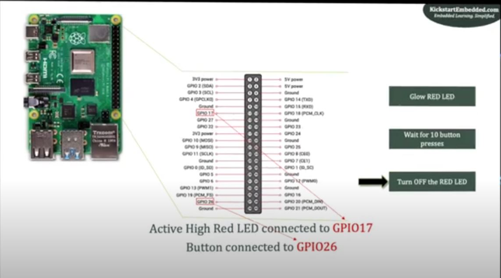

# pcf8574
Source Content can be found here:[^1][^2]
[^1]: https://www.waveshare.com/wiki/Raspberry_Pi_Tutorial_Series:_I2C
[^2]: https://www.waveshare.com/wiki/Pioneer600#OLED_Sample_Demos
## I<sup>2</sup>C communication with Raspberry Pi

Commands to use once the I<sup>2</sup>C interface is started   
```
i2cdetect -y 1
```

### Control PCF8574 IO using i2c-tools
PCF8574 is a I<sup>2</sup>C chip which can expand IO up to 8 and the initial state of IO is HIGH. Different from other I<sup>2</sup>C chips, the PCF8574 has no register, instead, a byte to specify the address on that chip to write to is always used to control the IO:


```
i2cset -y 1 0x20 0x7F
i2cget -y 1 0x20
```

### Compile commands
```
gcc -Wall pcf8574.c -o pcf8574
sudo ./pcf8574
```

The method used here is called controlled by ***sysfs***.  Unfortunately it has been depricated in recent linux kernels.  This was used here because linux command `hostnamectl` showed the version of linux to be bookworm where only the lgpio library is available.  Source: https://www.waveshare.com/wiki/Libraries_Installation_for_RPi. 


Source for markdown:  
https://www.markdownguide.org/extended-syntax/  
https://www.youtube.com/watch?v=_PPWWRV6gbA  

I like the task list section<br>
- [x] Do PCF8574 contection code.
- [x] Allow for control C to clean up the code.[^3]
- [ ] Order AHT20 temperature sensor.
- [ ] Interface the AHT20 temperature sensor into this design or a new file.

**bold**  
*italics*  
***both***  
~~crossed off~~  
<mark>highlight</mark>  


```c++
/// Does this work
const int var = 10;
```

[This is a link](https://google.com)  
or  
[License File](/LICENSE)  
or   
[Compile commands](#Compile-commands)  


> block quote
>
>> Nested

***

   


list nesting requires 4 spaces or tab

- [ ] This is the first item in the todo list
    - [ ] Checking if this nests.
        - unorded item.
            1. ordered item.


Tables can be done this way:

| C/C++        | Python   |
|:---          |:-----:   |
|  sysfs       | Gpiozero |
|  libgpiod    | RPi.GPIO |
|  pigpio      |          |
|  Processing3 |          |

## Reading List:  
<https://www.thegoodpenguin.co.uk/blog/stop-using-sys-class-gpio-its-deprecated/>
<https://github.com/sckulkarni246/ke-rpi-samples/blob/main/gpio-c-sysfs/gpio_usage_sysfs.c>
<https://www.kernel.org/doc/Documentation/devicetree/bindings/leds/leds-gpio.txt>  
<https://www.kernel.org/doc/Documentation/devicetree/bindings/input/gpio-keys.txt>  
<https://www.kernel.org/doc/html/v4.17/driver-api/gpio/drivers-on-gpio.html>
<https://www.kernel.org/doc/html/v4.17/driver-api/i2c.html>


[^3]:https://www.youtube.com/watch?v=MuNXmh0Vu8A
